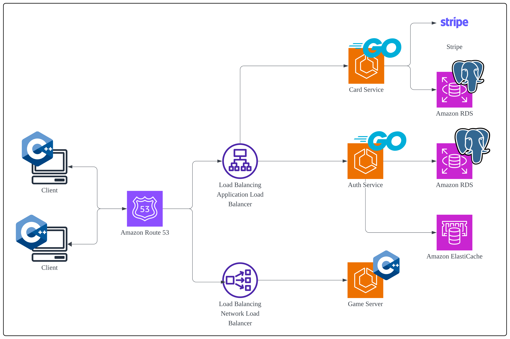
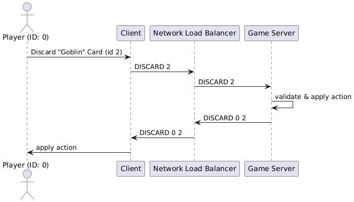
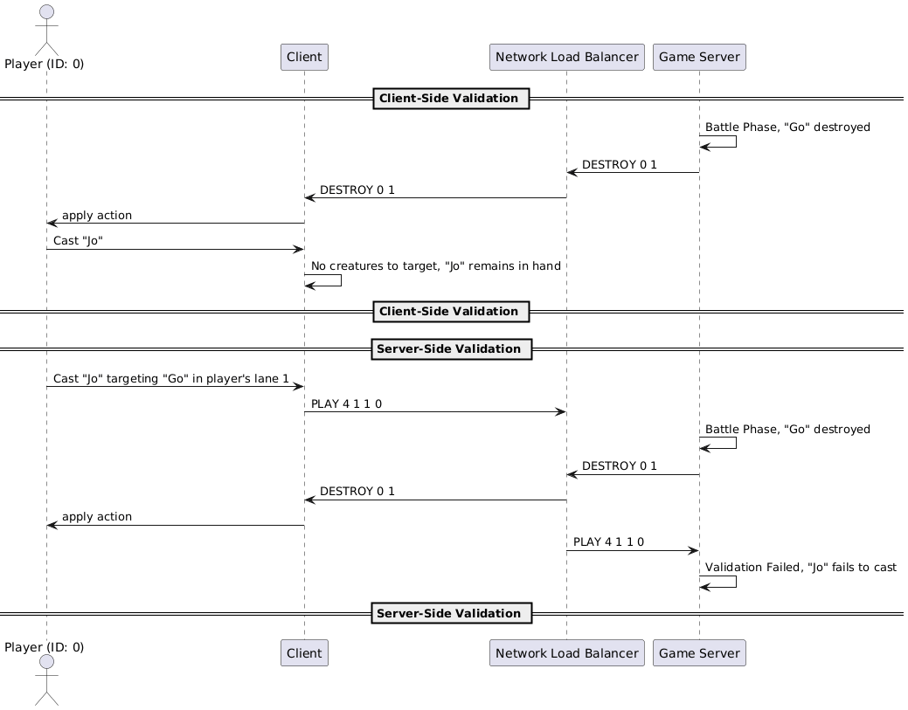
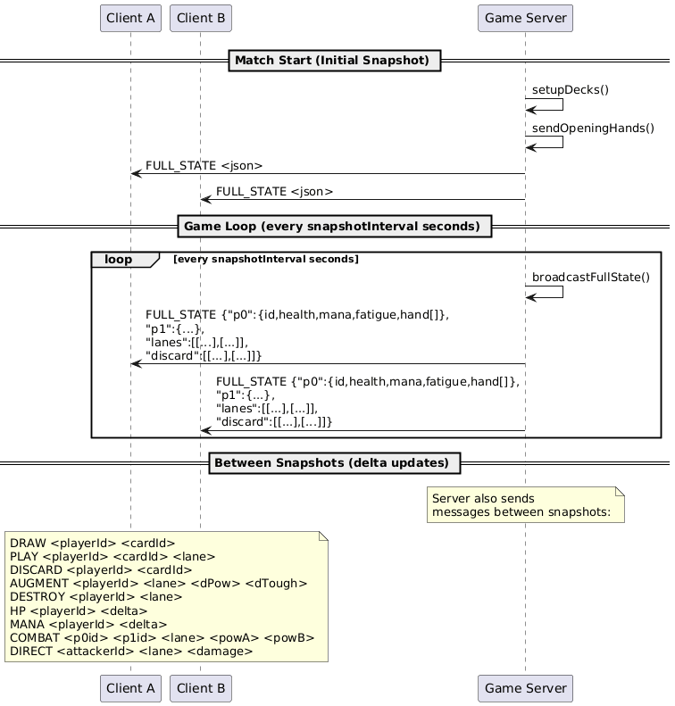

# Archcast

Archcast is an online multiplayer card game that utilises speed-based gameplay rather than the traditional turn-based format. The game's system design is separated into two main aspects: the game client and the backend services.

---

## Table of Contents

- [Architecture](#architecture)
- [Tech Stack](#tech-stack)
- [Features](#features)
  - [Gameplay](#gameplay)
  - [Deck Editor](#deck-editor)
  - [Pack Opening](#pack-opening)
  - [Coin Shop](#coin-shop)
  - [Audio](#audio)
- [Database](#database)
- [How to Run](#how-to-run)
  - [Local Machine](#local-machine)
  - [Cloud (AWS)](#cloud-aws)
- [CI/CD](#cicd)
- [Future Work](#future-work)

---

## Architecture



### Game Client

- Exists as a desktop application run from your local machine, and is the main method of communication with the backend services. Can be downloaded using a setup installer that uses InnoSetup.
- Connects to the Game Server via SSL-secured socket connection, chosen to provide minimal latency whilst still ensuring ordered delivery of data to the Game Server.
- Auxiliary requests (e.g. updating deck, login, etc.) instead use REST via HTTPS, sent to the Card/Auth services. REST was mainly chosen for development simplicity, especially since we did not know how long it would take us to fully implement the game proper.

### Game Server

- Responsible for accepting socket connections from Game Clients, and pairing them up into matches.
- Acts as the single source of truth for each match's game state. Each match exists as its own thread where cleanup is automatically handled upon match completion.
- Communicates with protected Cards and Auth service endpoints using an internal API key.

### Auth Service

- Handles login and registration of users.
- Seeds inventory and deck for new users.
- Ensures that the same user cannot be logged in on multiple instances through session handling in conjunction with Redis.
- Contains protected endpoints that can only be accessed if a user is logged in, or if the header contains an internal API key.

### Card Service

- Handles users' inventory, decks, and payment through connection with Stripe.
- To simplify card management and ensure consistency during gameplay, the cards service acts as the single source of truth for maintaining the current card balances.
- Contains protected endpoints that can only be accessed if a user is logged in, or if the header contains an internal API key.

---

## Tech Stack

| Technology | Purpose |
|---|---|
| **C++** | Game client and Game server. Chosen for its low-level performance and ownership patterns for managing card states (e.g. location on board, discard pile, etc.). |
| **Golang** | Auth and Card services. Chosen for simplicity, strong performance, comprehensive standard library, and straightforward deployment as a single binary. |
| **PostgreSQL** | Relational databases. ACID-compliant with JSON support, helpful for storing deck information. |
| **Redis** | User session store, preventing multi-instance logins and authorising calls to protected endpoints. |
| **Terraform** | Infrastructure as code for provisioning and managing AWS resources consistently, reproducibly, and version-controlled. |

---

## Features

### Gameplay


#### Mechanics

- Each player starts with a fixed hand of 5 cards, and a card is automatically drawn every 5 seconds, for a max hand size of 7. If a player's deck runs out of cards, they receive fatigue damage every draw phase, starting at 1 and incrementing with every draw.
- Players can drag and drop cards into their discard pile to gain mana. The mana value is represented by the circle at the bottom of each card.
- Players can drag cards into 1 of their 5 play zones to play them. The cost is shown by the circle at the top-right of the card; players with insufficient mana cannot play the card.

**Card Types:**

- **Creature**: summoned to the board with set ATK and DEF values. Some creatures have additional effects shown in the card text, or specialised effects represented by a keyword and a purple hexagonal badge on the top-left of the card.
- **Spell**: do not persist on the board and are removed from hand once cast. Some require the player to select a target; others activate instantly. Spell cards can be played onto zones that already have creatures on them.

**Battle**
- At a fixed interval of 5 seconds, all creatures on the board undergo a battle phase.
- If both players have a creature on the same lane, those creatures battle: ATK is subtracted from the opposing creature's DEF, and the creature is destroyed if DEF reaches 0.
- If only one side of a lane has a creature, it attacks the opponent directly for damage equal to its ATK value.

**Game End Conditions**
- A player's HP reaches 0
- A player surrenders
- A player disconnects from the server

#### Data Transfer



- Messages are exchanged between client and server over an SSL-secured socket connection, sent as either pure strings (e.g. `HP 1 -5`) or JSON. This minimises latency in parsing and simplifies development. State mutations use strings due to their simplistic single-mutation nature; complex messages like game state snapshots use JSON.
- As the game server is the single source of truth, **client messages do not directly mutate client game state**. All messages must be received and processed by the server first, which then sends back the authoritative update.
- Message receiving on the server is **callback-driven**, with messages queued and processed sequentially to prevent race conditions (e.g. a draw from both players' HP reaching 0 simultaneously).



- A mix of client-side and server-side checking is used to prevent conflicts in game state mutation.

#### Game State Consistency


- To prevent client-server desync, the server periodically sends full game state snapshots (cards in hand, HP, mana, cards on board, etc.) in JSON format. The client checks its local state against the snapshot on receipt and self-corrects any inaccuracies.
- This also ensures server-side logic errors are immediately visible on the client, rather than being silently hidden, allowing for more precise troubleshooting.

#### Animation & Rendering

- An animation interface contract defines a common lifecycle for all animations: initialisation, per-frame updates, completion checks, and whether the animation blocks gameplay.
- The animation queue manages pending animations by:
  - Scheduling them with optional delays
  - Updating all active animations each frame using delta time
  - Removing completed animations and consuming the next after an optional delay
  - Tracking whether any blocking animations are still running
- Multiple animations can occur simultaneously, making the UI more responsive to game state changes.
- Rendering composes the complete visual frame including board zones, cards, UI elements, overlays, previews, and active animations in the correct order.
- Commonly used components are cached upon first draw and reused. The cache is invalidated when changes require redraws (e.g. window resize causing card dimensions to change).

---

### Deck Editor

The Deck Editor allows players to build a playable deck from their owned card collection via drag-and-drop and right-click shortcuts, with immediate visual feedback (copy counters, dimmed exhausted cards, deck count progress, and hover previews). A deck can only be saved or queued for play once it meets rule constraints, after which changes are propagated to the backend via HTTPS.

**Three validation layers are used:**

1. **Client-side legality checks**: Blocks invalid actions in real time (over deck size, over copy limit, or adding unowned cards) with status messages.
2. **Inventory-aware copy accounting**: Remaining copies are computed from inventory minus current deck usage, so the UI always reflects what the player can legally add.
3. **Server-side enforcement**: On save, the backend re-validates deck size and payload structure before persisting, preventing malformed or tampered submissions.

To keep the editor responsive with large collections, the UI uses scaled layouts, pagination, bounded scrolling, and renders only currently visible deck entries.

On the backend, card data, inventory, and deck configurations are fetched from dedicated service endpoints. After saving, the client refreshes its local deck state before moving into matchmaking to ensure everything is up to date.

---

### Pack Opening

- Packs cost 100 coins each. Drawn cards are added to the player's inventory. If the player already owns the maximum copies of a card (4), they are refunded 10 coins per duplicate.
- Changes to inventory and coin count are propagated to the backend via HTTPS request.

To minimise client-side latency, a local caching mechanism batches changes before flushing them in bulk. Three triggers determine when a flush occurs:

- **Debounce**: If no new pack has been opened for a set time, a flush is attempted. Prevents excessive requests from rapid pack opening.
- **Window expiry**: The timestamp of the first pending (dirty) change is tracked. If elapsed time exceeds a predetermined window, a flush is forced regardless of activity. This prevents the server from being starved indefinitely.
- **Delta hard cap**: If the number of cards added or the coin delta reaches a threshold, a flush is forced immediately.

An exponential backoff is used for failed flush retries, doubling the wait time up to a configured maximum. Exiting the Pack Opening page also triggers a flush as a safety precaution.

This ensures the UI remains instant, and even in the event of a crash, the maximum unsynced state is predictable and bounded.

---

### Coin Shop

Players can purchase coins (also earnable by winning matches) by selecting from 1 of 3 packages, after which they are redirected via browser to complete their purchase through Stripe.

- Package metadata is pulled at runtime from `GET /cards/payments/coin-packages`. Each package includes `id`, `coins`, `amount_cents`, `currency`, and optional discount metadata.
- When a player selects a package, the client posts only the `package_id` and user context to `POST /cards/payments/checkout-session`. The backend validates the package against its authoritative catalog and creates a Stripe Checkout Session with embedded metadata (`uid`, `package_id`, `coins`).
- Product images are served client-side to reduce backend load.

**Stripe Checkout & Idempotency:**

- Payments use Stripe-hosted Checkout for PCI-safe transaction handling.
- The backend webhook handler verifies Stripe signatures (`Stripe-Signature` + webhook secret) and only processes `checkout.session.completed` events with a confirmed `paid` status.
- Successful events trigger a single database transaction that:
  1. Writes a payment ledger record keyed by unique event ID (idempotency guard)
  2. Upserts inventory balance with an atomic increment expression
- This guarantees **exactly-once credit semantics** for duplicate webhook deliveries and prevents partial updates. A checkout-status endpoint can reconcile delayed client confirmations by querying Stripe session state and applying the same idempotent purchase path.

---

### Audio

- Audio is handled by a centralised `Audio` class, split into two sub-types: **sound effects (SFX)** and **music**.
- Music changes based on the current application state.
- SFXs are used primarily during gameplay (in conjunction with animations) and pack opening.
- SFXs are loaded from .wav files since they are extremely short in duration (ranging in seconds), and thus can afford to be lossless since they are not overtly large in file size. 
- Music tracks are loaded from .mp3 files due to their much longer duration (ranging in minutes), thus necessitating lossy compression to balance between audio quality and file size.


---

## Database

### Models

#### Player

| Field | Description |
|---|---|
| `Username` | Unique account handle for login and display. Normalised (trimmed, canonical case) before persistence. |
| `Email` | Primary contact and authentication identifier. Stored normalised (e.g. lowercase), enforced as unique. |
| `PasswordHash` | bcrypt hash of the user's password. Plaintext is never stored. |
| `sessionId` | UUID session token stored in Redis with 24h TTL. Maps session-to-user and user-to-session for protected endpoints and logout invalidation. |

#### Deck

| Field | Description |
|---|---|
| `PlayerID (Uid)` | Primary key for the deck owner. One deck record per user; creating a deck replaces any existing one. |
| `Cards map[cid]qty` | Sparse map of card ID → quantity, persisted as JSONB. Deck validation enforces exact deck size (default: 30 cards). Auto-fill prioritises owned cards, then fills from the global catalog in deterministic CID order. |

#### Cards

| Field | Description |
|---|---|
| `Cid` | Integer primary key for a card definition. |
| `Name` | Display label of the card. |
| `Type` | Gameplay category/classification (e.g. Spell, Creature). |
| `Cost` | Mana cost to play the card. |
| `Value` | General numeric value used by game logic and balancing. |
| `Power` | Offensive stat used in combat resolution. |
| `Toughness` | Defensive/health stat used in combat resolution. |
| `Effect` | Description of the card's special behaviour. |

#### Inventory

| Field | Description |
|---|---|
| `PlayerID (Uid)` | Primary key linking inventory to a single user. |
| `Coins` | Integer balance for purchases and in-game economy operations. |
| `Cards map[cid]qty` | Owned card counts keyed by CID, stored as JSON. |

#### CoinPackage

| Model | Description |
|---|---|
| `CheckoutSessionRequest` | Contains user ID, selected package, success URL, and cancel URL. Used to create a hosted Stripe Checkout session. |
| `CheckoutSessionResponse` | Returns Stripe session ID and redirect URL for browser checkout. |
| `DirectCardPaymentRequest` | Contains user/package context plus raw card payment fields. Typically gated/disabled in production in favour of hosted checkout. |
| `DirectCardPaymentResponse` | Returns payment ID, status, and paid boolean. |

#### PaymentLedger

| Field | Description |
|---|---|
| `Id` | Primary key for the ledger row. |
| `Event_id` | Unique Stripe-derived event key. Unique index enforces idempotency against duplicate webhook deliveries. |
| `Session_id` | Checkout/payment session identifier for traceability. |
| `Uid` | User receiving the coin credit. |
| `coins` | Credited coin amount. |
| `Amount_cents` | Recorded purchase amount at time of processing. |
| `Currency` | Recorded purchase currency. |
| `Created_at` | Audit timestamp for reconciliation and reporting. |

---

## How to Run

### Local Machine

#### Backend

1. Ensure `/certs` contains `server.crt` and `server.key` in `/auth`, `/cards`, and `/server`.
2. Ensure `.env` exists in the root directory.
3. From the root, run:
   ```bash
   docker compose up --build
   ```

#### Client (Executable)

1. Download the appropriate **local** setup executable from the Releases page. The local setup connects to the local Docker backend.
2. Run the setup to install the application.

#### Client (Manual Compile)

1. Ensure `.env` exists in `/client/env`.
2. Navigate to the client directory:
   ```bash
   cd /client
   ```

**Windows (requires [MSYS2](https://www.msys2.org/)):**
```powershell
./setup.ps1
mingw32-make clean
mingw32-make
./main
```

**macOS:**
```bash
chmod +x setup.sh
./setup.sh
make clean -f Makefile.mac
make -f Makefile.mac
./main
```

---

### Cloud (AWS)

#### Backend

**1. Copy the example secrets file:**
```bash
cp secret.tfvars.example secrets.tfvars
```

**2. Gather Required Credentials and populate `secrets.tfvars`:**

| Credential | How to obtain |
|---|---|
| **TLS Certificate** | Add `server.crt` and `server.key` to AWS Secrets Manager as `tls_cert` and `tls_key` respectively. |
| `github_username` | Your GitHub username. |
| `github_repo_name` | Your repository name. |
| `github_token` | Create a Personal Access Token: *GitHub → Settings → Developer Settings → Personal Access Tokens*. Grant: `repo`, `write:packages`, `read:packages`. |
| `stripe_secret_key` | *Stripe Dashboard → Developers → API Keys → Secret key*. |
| `stripe_webhook_secret` | *Stripe Dashboard → Developers → Webhooks → Create endpoint → Reveal signing secret*. |
| `internal_api_key` | Generate with: `openssl rand -hex 32` |

**3. Initial Terraform Run (Secrets Setup):**

In `secrets.tfvars`, set:
```
skip_secrets_manager = false
```

Then run:
```bash
cd data
terraform apply -var-file="../secrets.tfvars"
```

**4. Capture Generated Outputs:**

After Terraform completes, copy the following outputs back into `secrets.tfvars`:
- `ghcr_pat_secret_arn` → use for `acm_certificate_arn`
- `auth_postgres_runtime_secret_arn` → use for `Ghcr_pat_secret_arn` and `Existing_ghcr_secret_arn`

**5. Finalise and Deploy:**

In `secrets.tfvars`, set:
```
skip_secrets_manager = true
```

Then from the root:
```powershell
./terraform-all.ps1 apply -AutoApprove
```

**Destroy Infrastructure (Cleanup):**
```powershell
./terraform-all.ps1 destroy -AutoApprove
```

#### Client

1. Download the appropriate **deployed** setup executable from the Releases page. This setup connects to the deployed AWS infrastructure.
2. Run the setup to install the application.

---

## CI/CD

- **Path-based filtering** ensures commits in one service (e.g. `/client`) do not trigger workflows for unrelated services (e.g. cards service tests).
- **Linting** runs for Golang, C++, and Terraform. Tests are run with a 90% coverage threshold, and jobs fail with an explicit error message if coverage falls below this. Coverage output is also written to the step summary as a formatted code block.
- **Service release pipeline** uses a matrix strategy over `auth`, `cards`, and `server`, building all three in parallel. Branch-to-tag resolution outputs `latest` for `main` and the literal branch name for any other branch (e.g. `https`), allowing other branches to maintain their own live GHCR image distinct from `latest`.
- **Image pruning** runs inline after each push. It uses the GitHub CLI (`gh api`) to enumerate all package versions and deletes any version whose tags don't include `latest` or `https`, keeping only two live image versions per service in GHCR.
- **Client release pipeline** assembles the client into installers downloadable from the GitHub Releases page.
- Only the **5 most recent caches** are retained; the rest are pruned. All artifacts are pruned unconditionally. This is done to avoid hitting GitHub Actions storage constraints.

---

## Further Work

### Features

- **Match Replay**: Since game state changes are driven by server commands, replay functionality can be added by storing those commands and using them to re-simulate each match.
- **Ranked Matchmaking**: Assign accounts a skill rating and match players of similar skill levels to reduce unbalanced matchups.
- **Local Gameplay**: Currently the game strictly requires the game server to function. A local/offline mode would reduce this dependency.
- **Mobile Support**: Given the short match duration, a mobile client could be a logical expansion to broaden the user base.

### Architecture

- **Remove image API dependency for card assets**: Move card image loading fully to local client assets, removing the `/images` endpoint dependency for gameplay. Add a simple manifest (image name → hash/version) to enable batched asset updates without a full client reinstall.
- **Make card effects data-driven**: Move card effect definitions to the cards service as structured JSON data with a validated schema, rather than hardcoded game-server mappings. Introduce a shared effect interpreter so new cards can be added via data changes rather than code changes. Add validation and simulation tests for effect payloads.
- **Expand payment provider support**: Keep Stripe as the default but introduce a payment provider abstraction layer for additional providers. Implement provider-neutral checkout and webhook handling with idempotency keys. Evaluate future integrations such as Steam Wallet via Steam APIs.

### Client

- **Visual Clarity**: Add a consistent UI scaling system for different resolutions and aspect ratios. Improve text/card readability with stronger contrast presets and font size accessibility options. Improve feedback states (hover, disabled, loading, selected). Standardise visual art direction and switch out all borrowed assets.
- **Tutorial and Onboarding**: Add an interactive step-by-step first-time tutorial for core gameplay, pack purchasing, and deck management. Provide contextual tips for advanced mechanics in menus. Add a replayable tutorial mode and a rules reference panel accessible from the main menu.